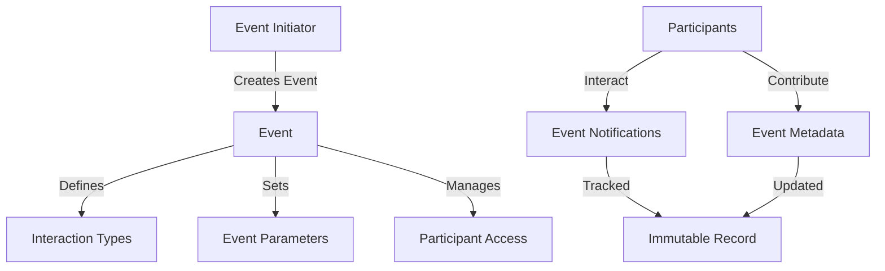

# Notify RFC: Decentralized Event Notification Protocol

A blockchain-powered Request for Comments (RFC) style event notification and interaction system that enables transparent, secure, and flexible event management on the Stacks blockchain.

## Overview

Notify RFC provides a decentralized framework for:
- Creating and managing events with granular control
- Supporting multiple interaction types
- Maintaining privacy and authentication
- Enabling community-driven event governance
- Facilitating transparent event tracking

### Key Features
- Flexible event configuration
- Multi-type event interactions
- Authenticated participation mechanisms
- Immutable event records
- Dynamic event lifecycle management
- Permissionless event creation

## Architecture

The Notify RFC protocol uses a core smart contract to manage event lifecycle, interactions, and governance.



### Core Components
- Decentralized Event Management
- Interaction Type Registry
- Participant Authentication
- Event Governance Mechanisms
- Transparent Event Tracking

## Contract Documentation

### event-notifier.clar

The primary contract implementing the Notify RFC protocol.

#### Key Data Structures
- `events`: Event configuration and metadata storage
- `event-participants`: Participant access management
- `event-interactions`: Interaction records
- `event-state-tracking`: Event lifecycle monitoring

#### Access Control
- Event creation: Open participation
- Event management: Creator-driven
- Event interactions: Configurable
- Event state: Transparent

## Getting Started

### Prerequisites
- Clarinet
- Stacks wallet
- Basic understanding of blockchain interactions

### Installation
1. Clone the repository
2. Install Clarinet dependencies
3. Deploy contracts to desired Stacks network

### Basic Usage

1. Create an event:
```clarity
(contract-call? .event-notifier create-event 
    "Community Governance Meeting" 
    "Quarterly protocol update discussion" 
    u1000 
    (list "proposal" "comment" "vote") 
    u0 
    u5 
    true 
    false)
```

2. Submit an event interaction:
```clarity
(contract-call? .event-notifier submit-comment-feedback 
    event-id 
    u"Proposed amendment to section 3.2" 
    false)
```

## Function Reference

### Event Management

```clarity
(create-event (title (string-ascii 100)) 
             (description (string-utf8 500)) 
             (duration uint) 
             (feedback-types (list 10 (string-ascii 20))) 
             (min-rating uint) 
             (max-rating uint) 
             (requires-authentication bool) 
             (incentive-enabled bool))
```

```clarity
(close-event (event-id uint))
(extend-event-duration (event-id uint) (additional-blocks uint))
```

### Feedback Submission

```clarity
(submit-rating-feedback (event-id uint) (rating-value uint) (anonymous bool))
(submit-reaction-feedback (event-id uint) (reaction-value (string-ascii 20)) (anonymous bool))
(submit-text-feedback (event-id uint) (text-value (string-utf8 280)) (anonymous bool))
```

### Query Functions

```clarity
(get-event (event-id uint))
(get-event-feedback (event-id uint))
(get-average-rating (event-id uint))
```

## Development

### Testing
Run tests using Clarinet:
```bash
clarinet test
```

### Local Development
1. Start Clarinet console:
```bash
clarinet console
```

2. Deploy contracts:
```bash
clarinet deploy
```

## Security Considerations

### Limitations
- Block height-based event timing
- Interaction type constraints
- Rate limiting for event submissions

### Best Practices
- Verify event status before interactions
- Use anonymous submissions for sensitive contexts
- Validate interaction types and values
- Implement governance mechanisms
- Monitor event participation

### Privacy and Governance Guidelines
- Configure authentication requirements carefully
- Use anonymous submissions when appropriate
- Design interaction types with privacy in mind
- Consider long-term blockchain data persistence
- Implement multi-stage governance processes